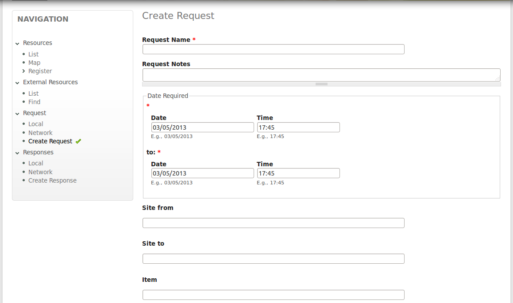

## What is Sierra?

Sierra is a prototypical architecture and implementation that shows how emergency response tools can cooperate to share information and coordinate a decentralised response, but still remain independent.

The decentralised resource management between multiple responder organisations in a crisis. The project started as an experiment on the Disaster 2.0 project funded by the European commission. The aim was to see how Semantic Web/Linked Open Data technology could be used to improve disaster response. Sierra consists of an architecture and a Drupal based tool (currently under development) that implements the architecture.

Several open-source online emergency response tools have been made available such as [Google Person Finder](http://google.org/personfinder/), [Ushahidi](http://www.ushahidi.com/), [Sahana Eden](http://eden.sahanafoundation.org/) and these have become widely used by NGOs in crisis. Each deployment of these tool is completely independent of any other, so many organisations simultaneously deploy the tool. However, the information collected about the same emergency in separate systems is not available to separate responders, even if there is overlap in the data.

## The Sierra Architecture - decentralised crisis coordination 

A single Sierra installation is useful to manage the resources of a single organisation. However, the system becomes more useful when several installations are deployed as an interoperable network. Sites communicate using an semantic web protocol and the SPARQL query language. Sites can search each other for resources, make requests for resources and respond to requests made for resources. Sites remain completely independent and do give control of their resources to third parties.

An example network might look like:

## Screenshots

## Install Instructions

## People

People who have contributed to the project.

- Seyyed
- [Drew](//dhornbein.com)
- Lisha
- Christopher
- Roser
- Shuangyan

## Technology

- Drupal
- RDF
- SPARQL (ARC2 library)
- OpenLayers

## Funding

This research has been supported by the Disaster 2.0 project [http://www.disaster20.eu](http://www.disaster20.eu) funded by the "Prevention, preparedness and consequence management of terrorism and other security-related risks" programme, European Commission, Directorate-Home Affairs (HOME/2010/CIPS/AG/002).

